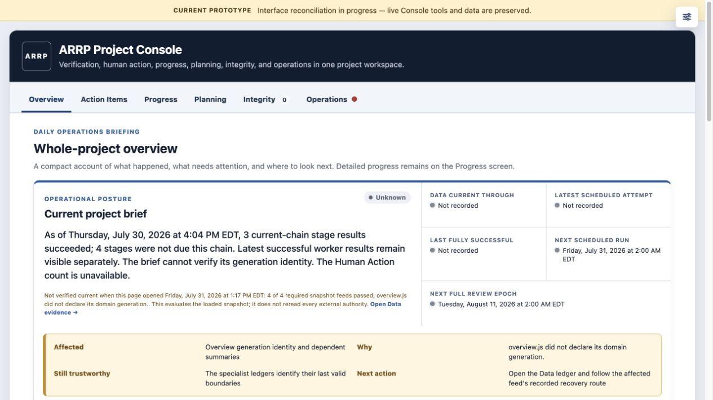
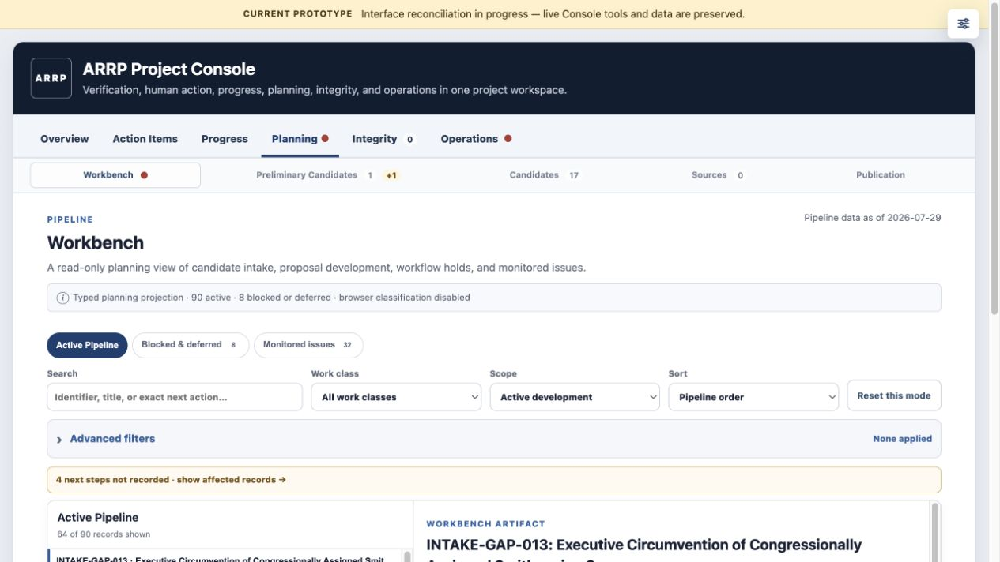
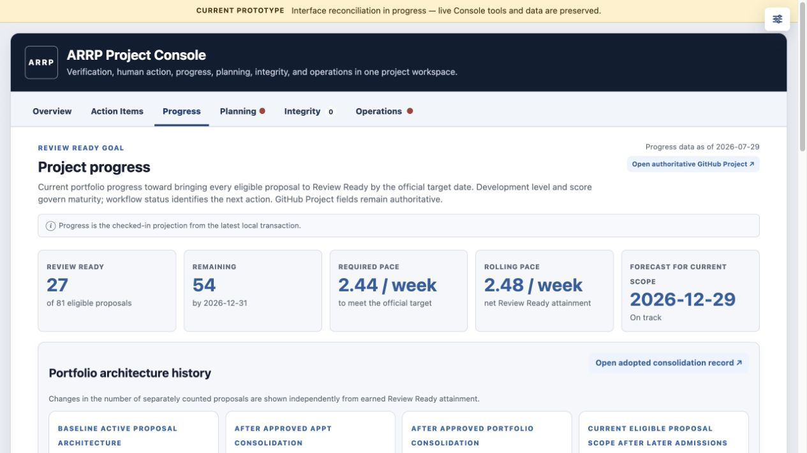
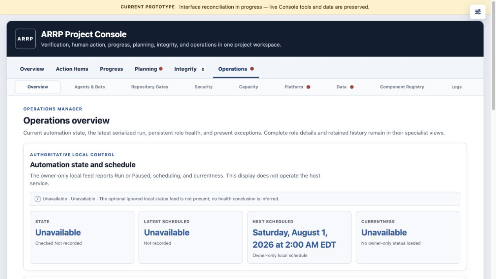

# ARRP Project Console and Interface Configuration

## 1. Document Purpose and Authority

### Document control

| Field | Current value |
|---|---|
| Stable document identity | `project_tool_interface` |
| Version | `1.2` |
| Status | Active |
| Approval | Approved by `@Thorncrag` on 2026-07-31 |
| Authority role | Governing configuration for the ARRP Project Console and related project-operated interfaces |
| Owner and review | `@Thorncrag`; owner review required |
| Canonical source | `framework/project/interfaces/project-console/specification.md` |

Version 1.2 retains the approved version 1.0 visual baseline and version 1.1
stable identity while aligning the Component Registry reference interface with
the adopted Stage 3 data model. Earlier development history remains available
through Git and the Console Development Log; no retrospective version numbers
are assigned without contemporaneous evidence.

### Purpose and Governing Authorities

This file configures the ARRP Project Console under the reusable
[Project Interface Standard](../../../standards/interfaces/standard.md), the
[Progress View Standard](../../../standards/interfaces/progress-views.md), and
ARRP's [tool visual identity](../visual-identity.md).

Candidate terminology and identifiers are governed by the
[ARRP candidate workflow](../../workflows/candidate-review.md#preliminary-candidate-synthesis-and-promotion),
and the exact source catalogs and routing fields are governed by the
[ARRP source workflow](../../workflows/source-adjudication.md). This file governs
where and how those records are presented in project-operated interfaces.

Console views are nonauthoritative projections: lifecycle and candidate authority remains in GitHub, bibliographic authority remains in the two source catalogs, canonical Markdown logs remain authoritative for their named histories, the immutable validated Operational Incident record is the sole authority for `INC` identity, occurrence history, operational recovery, and closure, and the distinct owner-local Security Incident record is the sole authority for `SEC` identity, investigation, containment, remediation, restricted evidence, security verification, and closure. A typed relation journal may link one `INC` and one `SEC` without changing either authority or lifecycle. Committed Elim Run Log discovery markers remain the durable gap-reconstruction authority, presidential-directive identity and review history remains in the directive registry, and print disposition and assembly authority remain in page front matter and [`print-assembly.json`](../../publication/print-assembly.json). The Publication assignment view must make included, explicitly excluded, unclassified, and conflicting outcomes independently visible. Routine issue monitoring remains in Planning > Workbench and does not count as a human Action Item unless it produces an exception or decision requiring attention; automated watcher and source-bot operations remain in Sources. Routine Elim-owned gap review, and retained `forbidden`, `unsafe`, `out_of_scope`, or `uncertain` observations that do not require a human act, remain in Integrity or Agents & Bots. They enter Action Items only when an exact human judgment, credential, unsafe external action, owner-gated decision, or intervention is required. Locally staged publication changes remain in Publication and likewise do not count as Action Items. The Action Items view must route each count to its complete owning view and must not duplicate narrative workflow records. The Logs view is read-only, retains complete entries without pagination, and links to each authoritative log or retained bounded feed; it must not become a separately maintained ledger. Publication controls may stage and export instruction lists for Codex, but do not persist drafts or edit canonical files.

## 2. Product Definition

### Whole-Console Product Contract

#### Product purpose

The Console is an internal, nonauthoritative management, verification, and
navigation surface. It must let the manager determine:

1. what project data is trustworthy and through what time;
2. whether the latest complete automation chain succeeded;
3. what requires human attention;
4. what changed materially;
5. where the complete specialist record for each summary lives; and
6. which Console revision introduced, changed, moved, or retired a behavior.

It is not a second project-management system, a source of research or
governance authority, a generic portal directory, or an autonomous decision
maker. A projection disagreement is repaired at the earliest owning or
producing layer. The browser must not guess away a contradiction.

#### Governing product principles

- **One primary home.** Every complete inventory, history, or diagnostic
  domain has one specialist home. Other screens may summarize and route to it.
- **Assertion plus provenance.** Each changing assertion carries the date and
  identity that qualify it. Interface generation time never substitutes for
  data currentness.
- **Explicit uncertainty.** Use `Last valid retained`, `Stale`, `Incomplete`,
  `Unavailable`, or `Rebuilding` when appropriate. Unavailable never renders
  as zero.
- **Calm by default.** The default emphasizes current truth, human decisions,
  and exceptions. Repetition does not substitute for priority.
- **Shared behavior.** Common dates, states, list selection, master/detail
  interaction, routes, provenance, and responsive behavior are implemented
  consistently.
- **Complete records, bounded rendering.** Logical histories remain complete,
  while long lists scroll or render incrementally inside contained working
  surfaces.
- **Root-cause correction.** A verified flaw in producer order, schema,
  identity, routing, taxonomy, or authority that makes the Console untruthful
  is corrected within the owning project layer.

## 3. Information Architecture

### Project Console Information Architecture

The ARRP Project Console has six primary tabs in this order: **Overview**, a
compact project-wide orientation; **Action Items**, the central linked inbox
for matters requiring human review or intervention; **Progress**, containing
current development status, trajectory, and portfolio history;
**Planning**, a navigation category containing Workbench, Preliminary
Candidates, Candidates, Sources, and Publication; **Integrity**, containing the exact current Project
Integrity report and its findings; and **Operations**, containing Overview,
Agents & Bots, Repository gates, Security, Capacity, Platform, Data, Component
Registry, and Logs.

Planning defaults to Workbench and has no aggregate main-tab count. It groups
existing specialist ledgers without creating a new authority or duplicated
record. Public-input records route to Candidates after formal lifecycle
admission and to Preliminary Candidates while no formal candidate exists.
Workbench is the shared contextual planning surface for the active Pipeline,
blocked or deferred work, and monitored issues; Pipeline is its default ordered
category. Preliminary Candidates
and Candidates remain the complete dossiers. Sources and Publication use
the shared compact tertiary button row, disclosures, and bounded workspaces
rather than another full-width nested tab hierarchy. Legacy Candidates,
Sources, Publication, Planning > Next Work,
Progress > Next Work, and their deep routes remain supported as semantic
aliases to the corresponding Planning destination and meaningful filter.

Operations > Logs uses one compact horizontal log menu immediately above the
shared bounded newest-first master/detail workspace. It defaults to Operational
Incidents, then offers owner-local Security Incidents in owner file mode only,
and retains Horizon, Elim, Bots, Sources, Integrity history, Change audits, and
Governance changes, then Console development. Repository-source direct-disk,
loopback, and hosted/public
modes render both owner-local incident ledgers as unavailable rather than an
empty ledger or zero count. Logs is not a main tab and does not introduce
another nested full tab hierarchy.
The visible public-shell explanation is the single concise sentence
`Data unavailable outside the bound owner-local Console.` Detailed missing,
stale, malformed, or incompatible-feed reasons appear only inside a valid
owner Console.
Legacy log routes
redirect to Operations > Logs. Integrity remains the exact current report;
Integrity under Logs remains retained history.

## 4. Interface Design System

### Current interface component grammar

The approved prototype is the controlling visual direction. Reusable interface
artifacts follow one shared grammar across the Console rather than receiving
screen-specific restyling. A screen may vary composition when its function
requires it, but a familiar artifact must remain visually and behaviorally
recognizable everywhere it appears.

- **Navigation hierarchy.** The compact left-aligned main menu is the most
  prominent navigation layer. A full-width submenu is visibly subordinate to
  it. Tertiary navigation uses one compact, left-aligned rounded-button system
  with the same height, padding, type size, gap, selected state, and badge
  treatment across Planning and Operations. A screen may use a select only
  for a genuinely fourth-level specialist choice, not as an alternate visual
  treatment for equivalent tertiary navigation. Tertiary controls occupy one
  visually bounded control row without decorative separator rules above or
  below it.
- **Standard page hierarchy.** Except for purpose-built Overview dashboards, a
  page presents: eyebrow; title and optional exact numerical badge; page
  description; page-wide information or warning notice; optional summary
  portals; tertiary navigation; one functional control surface; and content.
  A right-aligned data/currentness note appears when the screen has one exact
  producer-declared boundary. Aggregated screens instead retain the exact date
  beside each assertion or portal and never substitute interface-generation
  time for mixed data currentness. A subordinate notice stays with the content
  or control it qualifies rather than interrupting the page-wide hierarchy.
- **Controls.** Search and primary filters remain visible together in one
  functional-control surface. Only secondary controls explicitly labeled
  `Advanced filters` may use a collapsed disclosure. Equivalent controls use
  the same field height, label size, spacing, focus state, and responsive
  behavior; a page does not collapse ordinary filters merely to reduce height.
  A single additional field is part of the ordinary control surface rather
  than an `Advanced filters` disclosure.
  A control that downloads a staged request must say that it downloads a
  request and must have adjacent plain-language copy stating that it does not
  execute the requested operation or mutate external settings.
- **Messages and states.** Informational and warning messages use the shared
  message containers and their `i` or `!` indicator. Dotted status labels use
  the common badge grammar and ordinarily occupy the upper-right state position
  of the container they qualify. A standalone colored dot may remain inline
  when it qualifies a single adjacent fact. Missing or inapplicable numerical
  navigation values are omitted rather than rendered as a dash or invented
  zero.
- **Portals and results.** Summary portals use the shared compact card grammar.
  A mail-style master/detail result portal uses one bounded internally scrolling
  list with one adjacent preview and does not also paginate. A table or board
  may paginate or incrementally render when scale requires it, but does not
  imitate the mail portal at the same time. Collapsible result rows use one
  compact summary: item name, important typed labels, and the standard leading
  disclosure control; additional detail belongs inside the expanded body.
- **Spacing and containment.** Shared spacing tokens govern the page header,
  notices, metrics, navigation, controls, and content. Nested borders are used
  only when they communicate an actual interaction or containment boundary;
  containers are not stacked merely to decorate a page. Explanatory text uses
  the available page width unless a deliberate reading-width constraint is
  part of the component.
- **Links and tools.** Equivalent external destinations use the shared compact
  external-link treatment; ordinary inline references remain text links. The
  interface toolbox uses one accessible icon-only trigger fixed at the top-right
  of every screen so it remains reachable without competing with project
  navigation. Layout-only controls, including a disclosure's
  saved default state, appear only while Layout mode is active and never
  clutter the ordinary read-only interface. Template inspection assigns stable
  region and component identifiers so like artifacts can be audited and
  reconciled as a family.

New interface work must first select an existing component family. A new
visual or behavioral variant requires a stated functional distinction and a
Console-wide compatibility review; filename, screen ownership, implementation
history, or local convenience is not a sufficient distinction.

### Compact Groups and Responsive Rows

Compact portal and metric groups occupy one deliberate desktop row whenever
their labels remain legible. The interface tightens copy, uses smaller spans,
or permits bounded horizontal overflow before allowing an accidental second
row. Multiple rows or stacking are reserved for intentional narrow-screen
layouts. This is a Console-wide rule, not an Overview-only exception: every
portal, metric, role, and compact status group must prefer one intentional
line before wrapping into a second row.

## 5. Global Interaction and Presentation Rules

### Personal layout design

Every Console screen supports grid-based personal layout design wherever a
section or card can safely resize. Design mode offers bounded widths such as
full, half, third, quarter, and compact, plus reordering and reset. Responsive
rules may widen a chosen size on smaller screens to prevent clipping,
unreadable text, inaccessible controls, or page overflow. Master/detail lists,
tables, and other interaction-specific workspaces retain their own internal
layout controls. Editing controls are mounted only while Design mode is active;
the saved layout continues to apply without hidden editing controls in the
ordinary page.

Personal layout drafts are stored only in that browser and are not project
authority, repository state, or a public default. Converting a settled personal
layout into the project default requires an explicit reviewed repository
change; it must not occur merely because a browser preference exists.

While Design mode is active, its exit button remains fixed at the top of the
viewport. Compatible Overview portlets may move among Operational indicators,
the Overview main flow, and the Overview lower row; placement is browser-local,
persists across rendering and reloads, and resets with the rest of that view.
Portlets do not move across main screens or into specialist ledgers.

### Dates, Counts, and State

Operational dates use producer-normalized ISO timestamps and render weekday,
month, day, year, local time, and time-zone abbreviation where they qualify a
current-state assertion. Use terms precisely:

- `Generated` for output creation;
- `Current through` for the last authoritative event included;
- `Checked` for an external observation;
- `Latest scheduled attempt` and `Last successful` for execution history;
- `Next scheduled run` for the next ordinary coordinator evaluation;
- `Next full Review Epoch` for the first scheduled evaluation at or after the
  recorded biweekly due boundary.

Every count has a canonical owner, exact inclusion predicate, open/resolved
scope, completeness declaration, and generated/checked identity. A navigation
button shows a number only when that number is an actionable queue owned by
the destination; it never shows inventory size, history length, role count, or
the number of records merely visible there. An accessible fixed-size red dot
is independent of counts and appears when a typed current blocker is
represented in that screen. A workflow record whose only condition is exact
`Blocked` or `Deferred` Status does not trigger that dot. Color never carries
meaning alone, and a status is not styled as an action.

`Notice` identifies expected unresolved work such as human action items or
public intake. `Warning` is reserved for degraded, stale, serious, or blocking
conditions; `Error` identifies a failed or invalid condition.

## 6. Screen Specifications

### Overview Contract

An item belongs on Overview only when it materially improves current
whole-project orientation, can be stated compactly without misleading
compression, has a known source/count/date, routes to one complete specialist
home, and does not duplicate another Overview region. Publication posture and
specialist diagnostic inventories remain off Overview.

Overview contains exactly five functional regions:

1. **Current project brief.** One dated assertion beginning with a weekday,
   overall status, `Data current through`, `Latest scheduled attempt`, `Last fully
   successful`, `Next scheduled run`, and `Next full Review Epoch`. A degraded
   state explains `Affected`, `Why`, `Still trustworthy`, and `Next action`.
   The five fact cells occupy one desktop row. The separate loaded-snapshot
   verification may report `Verified` only when Progress, Integrity, Source
   checks, and Run chain are
   producer-declared current, structurally complete, timestamped, and
   generation-compatible. The brief always states the access-time verification
   result and makes clear that loaded-snapshot validation is not a live reread
   of every external authority. Each fact date has its own accessible colored
   dot. Green means healthy/current/successful/ready, yellow means an
   authoritative intentional Pause or suppression, red means confirmed
   failure or applicable blocker, and gray means the determination is not
   reliable. Red takes precedence over yellow. Data currentness follows each
   feed's cadence and may remain green while still fresh after a pause. Latest
   scheduled attempt uses the chronologically newest scheduled occurrence,
   never the newest historical success. Last fully successful mirrors the
   relationship to that occurrence. The next ordinary run and next full Review
   Epoch use separate blocker scopes plus the exact binary Run/Paused control;
   absence of a run never implies Paused. The general badge and Latest
   scheduled attempt dot derive from the same helper and cannot drift:
   `Current` is green, `Paused` is yellow, `Failed` is red, and an
   indeterminate latest outcome is gray. Unhealthy dates link to their
   specialist evidence where available.
2. **Latest automation chain.** Exactly seven ordered operational stages:
   Cases, Presidential directives, Sources, Public input, Progress, Integrity,
   and Elim. Each shows typed outcome and completed or checked time. The
   component also shows one compact future-run-gate line linked to Operations
   > Repository gates. Latest-attempt blockers and future repository gates
   derive from one typed automation-readiness projection; an affected gate is
   identified on its typed stage rather than repeated as another Overview
   card. Host closeout, publication, and planning remain chain metadata.
3. **Operational indicators.** Five peer summaries: Public intake, Human
   action items, Codex capacity, Platform status, and Project data. Each routes
   to its complete specialist ledger. Platform and Project data may use
   compact half-width treatment when their at-a-glance cells remain legible.
4. **Work queues.** Small work-only portlets containing queue name, unresolved
   count, and detail route. If the queue feed or processing path is unhealthy,
   add a text `Problem` flag and exact log route. Healthy queues do not show
   decorative status text. The ordinary queue portlets use a compact
   grid of individually outlined buckets rather than one subdivided container.
   Publication, Integrity, monitoring, and deferred inventories are not
   work queues merely because they contain records.
5. **Recent material activity.** A short chronological list of the latest
   score-changing issue-page updates in the registered active issue-development
   set. Each row identifies one exact canonical issue page, the latest matching
   audit-history entry, a concise audit summary, and the typed old-score to
   new-score transition. Area summaries, non-issue project records, generic
   Change Audit entries, automation, source-monitor, agent, and repository-review
   events do not enter this list. The producer parses the exact sibling audit
   history and publishes the typed fields; the browser only orders and presents
   them and never classifies narrative prose as activity. Work queues and
   Recent material activity share one balanced desktop row and stack when
   space is constrained.

Platform and data at-a-glance cells use the same five-peer-cell grammar inside
a lightly divided grid. Platform status contains GPTs, Codex, API platform,
Vercel, and Cloudflare Turnstile; Project data contains its five registered
feeds. Both use one deliberate horizontal row without an internal scrollbar
at ordinary desktop widths and switch together to the same responsive stack
only when the viewport requires it. A
green, yellow, red, or neutral dot supplies the compact visual; the cell text
is only the service/feed name. Accessible labels and the portlet-level problem
route retain meaning without relying on color alone.

### Specialist Screen Contracts

#### Action Items, Progress, Planning, Candidates, and Sources

These established workflows remain stable unless a change has high-confidence
usability or technical justification. Action Items is the model for a compact
selectable list with adjacent preview. Sources and other large record lists use
the same pattern where individual inspection is required: one concise row per
record, detail in the preview, bounded list height, and explicit empty,
unavailable, stale, or incomplete states. The Sources catalog keeps its search
and all catalog filters in one visible control surface. Its catalog results are
the email-style master/detail portal itself, not a collapsible container around
that portal.

Every unresolved Operational Incident appears in Action Items. Explicitly
human-owned incidents appear under My items and contribute to Human Action
Items; non-human-owned and unassigned incidents appear only under Oversight.
All open is their union. Main-tab and Overview Human Action Items counts remain
human-only, and unassigned incident ownership is itself an oversight problem.

Action Items begins with a compact **Priority attention** lead-in only when at
least one deterministically elevated human-owned record exists. It contains at
most five records and may elevate only an explicit blocking effect, Critical or
High priority, due or overdue timing, or a recorded consequential decision.
The browser does not invent a priority score. Ordinary unresolved human work
remains only in the complete Action Inbox, and non-human technical exceptions
remain in Automation blockers, Platform, or Data.

Progress is the portfolio measurement and current-state surface. It owns the
development-level board, Review Ready coverage, trajectory, and portfolio
history. It does not duplicate Workbench's hold or monitoring inventories.

Planning > **Workbench** is the sole detailed contextual work-sequencing
surface. **Pipeline** is its default category. Its subtitle is:
`A read-only planning view of candidate intake, proposal development, workflow
holds, and monitored issues.` Its compact tertiary controls provide **Active
Pipeline**, **Blocked & deferred (N)**, and **Monitored issues (N)** without
creating another navigation tier. The active view exposes Search,
Work class, Scope, and Sort, with Status, Development level, Area, Owner,
Priority, and related facets under Advanced filters. Scope defaults to Active
development; Review Ready+ and All remain explicit alternatives. Reset is
mode-specific.

Workbench > Pipeline uses the shared bounded master/detail interface: a compact selectable
list, complete adjacent preview, independent scrolling, responsive stacking,
keyboard selection, automatic first matching selection, and stable deep-linked
selection. Rows use no more than two lines and show identifier/title, work
class, status, score when applicable, and a clipped exact next action. Owner,
workstream, complete rationale, position explanation, readiness gaps, missing
inputs, and canonical links belong in the preview. The browser must not
synthesize work remaining before Review Ready unless the producer supplies
typed readiness gaps.

The typed Pipeline producer applies this precedence: exact human-decision
records route to Action Items; exact `Blocked` or `Deferred` Status routes to
the alternate Pipeline mode; reliably Review Ready or Release Candidate
records are hidden only from the default active scope; preliminary candidates,
formal candidates, and below-ready proposals remain active; contradictory or
unrecognized records remain visible as data or Integrity exceptions rather
than being silently classified. Publication approval belongs in Publication
and, when human-actionable, Action Items.

Default Active Pipeline order is deterministic: preliminary candidates,
formal candidates, then proposals by valid Development Score descending.
Within a class, exact-next-step completeness precedes recorded priority, due
date, and stable identifier. Candidate score is not applicable. Proposal score
`0` is valid and distinct from missing. Missing exact next action does not
remove an otherwise eligible record; it renders `Next step not recorded`,
sorts after complete peers in its class, and contributes to a compact
planning-data-gap count. Review Ready exclusion uses the complete typed
readiness predicate, not score or level alone, and maturity/score conflicts
remain visible.

Blocked & deferred contains only exact authoritative `Blocked` or `Deferred`
statuses at every maturity, preserving the two labels. It foregrounds the
dedicated hold reason, blocked action or missing prerequisite, unblock or
reconsideration trigger, hold transition date, last hold review, explicit
review date, owner, and audit/canonical links. The audit entry recording the
Status transition supplies `Hold since`; a later hold-review entry supplies
`Last reviewed`; an explicit reconsideration date supplies `Review due`.
Project Status without matching audit transition provenance is an Integrity
finding and Warning. Generic issue `updated_at` and candidate discovery or
admission rationale never substitute for hold facts.

The browser renders the small typed Pipeline projection and does not infer
planning membership from narrative text, monitoring incidents, or browser-only
cohorts. Overview queue counts and Pipeline filters share the same producer
predicates; an External review Overview route opens Review Ready+ scope. Fired
monitoring enters Pipeline only after its authoritative resulting workflow
Status or action does. Human decisions route to Action Items, and all Pipeline
records route to their single complete dossier or canonical ledger.

Each proposed-candidate view should be a decision dossier assembled from existing authoritative records: GitHub supplies issue and lifecycle data; the Horizon Scan Log supplies intake history, overlap, rationale, and follow-up; the two source inventories supply evidentiary records; and identifier-linked research supplies project analysis. Display missing inputs as record gaps rather than filling them with generated conclusions. The console may cache this derived presentation data, but it must not become a manually maintained narrative ledger or override its inputs; corrections belong in the record that owns the information. Canonical records and automation status remain read-only to the Console. The retired localhost coordinator control plane has no current authority and must not be exposed as an interface dependency. Manual runs use the owner-controlled installed bootstrap, and the Console may display only the checked-in local-first status projection. A local print-level draft and export is not an implementation; Codex must validate and apply it separately. Conduct every formal candidate decision within Codex under the full Horizon Candidate Adjudication Workflow.

#### Monitoring and Source Inspection

GitHub Issues and the Project Monitoring view are the issue-level monitoring-workflow authority. The Console separates issue workflow from source inspection: **Planning > Workbench** contains the read-only **Monitored issues** view, while **Sources** contains Court Cases, Presidential Directives, and Source Checks. The Workbench monitoring view organizes monitored matters by accountable ARRP owner and, where useful, by a named case family, executive-action episode, or other factual matter.

Every view must distinguish: (1) the external matter being watched; (2) why it is materially relevant to future issue development; (3) what development triggers reassessment; (4) whether a deterministic watcher, an LLM-assisted pass, or another stated checking method covers it; and (5) its latest known posture. Routine issue monitoring is intended for automated LLM-assisted review and is not itself a human Action Item merely because `needs: monitoring` remains present. Only a detected development, exception, or resulting decision that requires human attention enters Action Items. The console does not create, close, edit, or adjudicate an issue.

The **Sources** and **Pending sources** subviews expose each source's `Monitoring` value so a changing docket or similar record remains identifiable even when the owning issue is not currently in an issue-wide monitoring pass. Ordinary badges state the complete queue size. A visually distinct update badge states only a genuinely new or changed record awaiting review, using the directive registry status or an unresolved deterministic-watcher pull request; do not use the update color merely to restate a queue total. The substantive distinctions among issue monitoring, source monitoring, deferral, and blockage remain governed by [`monitoring.md`](../../../standards/sources/monitoring.md), [`source-records.md`](../../../standards/sources/source-records.md), and the [ARRP GitHub workflow](../../github/workflow.md).

#### Pending Source Presentation

The **Pending** tab is a small routing-decision view, not a development or monitoring backlog. Each retained row must identify the plausible competing destinations, explain why the project cannot yet choose among them, and state the exact source-specific review needed to decide ownership. Do not group pending records as citation-ready, litigation, monitoring, or general project development: once any one of those records has a clear owner, it belongs in that owner's source-development record and `sources.csv`. The tab projects `sources-pending.csv`; it does not duplicate or supersede the underlying record.

#### Integrity

Integrity means the exact Project Integrity report: report identity,
availability, generated time, revision, counts, and complete findings. Stage
execution belongs in Operations and retained run history belongs in Logs.
Cross-domain health cards are not combined into an apparent Integrity total.

#### Operations

Operations owns:

1. Overview — authoritative global Run/Paused state, scheduling and
   currentness; one compact seven-stage latest-run strip; seven persistent-role
   status cards; and current exceptions only. The strip describes one
   serialized run. Role cards instead use each role's latest applicable
   scheduled occurrence across its own cadence.
2. Agents & Bots — one role detail at a time behind the shared compact
   horizontal specialist menu. The stable role order is Coordinator, Case
   Monitor, Directives, Source Checker, Progress, Integrity, and Elim. Role
   detail owns purpose and authority, trigger, cadence, eligibility,
   environment/runtime, current recovery, runbook/report/log routes, and a
   collapsed browser-local `Staged configuration` workspace. Direct entry
   selects Coordinator; unknown or retired role routes remain explicitly
   unavailable rather than silently selecting another role. Global Run/Paused
   belongs only to Operations Overview, and no independent per-role pause
   control exists.
3. Repository gates — only pull requests explicitly typed by the complete
   reusable repository-gate producer as blocking future automation. The
   append-only declaration authority is the owner-local path
   `records/automation/repository-gates.jsonl` under the governed
   [repository-gate policy](../../automation/repository-gates.json). Authenticated
   Console refresh and scheduled/manual coordinator execution consume the same
   schema. A current future-run snapshot never rewrites historical run state;
   a gate counts against the latest attempt only when the coordinator applied
   its exact gate ID to that attempt.
4. Security — a safe operational-assurance and protective-action surface. Its
   compact status row shows public-intake `Live`, `Paused`, or `Unverified`;
   completed registered-check coverage; private attention as `None reported`,
   `Required`, or `Unavailable`; and a typed active-incident indicator. Its
   bounded master/detail workspace contains exactly the seven registered tool
   identities in
   [`classifications.json`](configuration/classifications.json):
   Public-intake protection, Repository change protection, Protected-surface
   change review, Automation isolation, Credential and access review,
   Disclosure-boundary verification, and Recovery readiness. Previews explain
   purpose and scope only. Provider-native alert contents, credential
   metadata, affected paths or components, rule identities, detector details,
   evidence, and remediation analysis remain at GitHub Security or in the
   owner-local Security Control Profile and never enter the Console projection
   or DOM. Unknown, stale, or incomplete private evidence renders unavailable,
   never zero or healthy. A successful check means completed coverage, not
   `secure` or `no vulnerabilities`.
5. Capacity — one exact-bound owner-local `codex-usage` projection shared with
   the Overview portlet. It presents the current plan/readback identity,
   percentages, reset identity, material reset-window history, typed reset
   anomalies, rate and even-spend estimates only when the producer declares
   sufficient coverage, and explicit confidence. It does not expose absolute
   capacity, prompts, task content, paths, tokens, credentials, or raw logs;
   it never treats a billing label or percentage as proof of an advertised
   denominator. Only the exact generation-bound owner-file Console may load
   the minimized projection. Public, hosted, loopback, and repository-source
   modes state `Data unavailable outside the bound owner-local Console.`
   The projection uses schema version 2, the opaque producer identity
   `owner-local-codex-usage-sampler`, a fixed 1,800-second sampling cadence,
   and only the 10,080-minute weekly window. `trustworthy_through` is exactly
   the earlier of the current observation plus one sampling cadence or its
   recorded reset boundary. A projection accessed after that instant is stale
   and unavailable; neither builder nor browser may extend it from schedule
   expectations. Reset identity is derived from the exact window and reset
   epoch, not a date label. Budget and burn-rate estimates have independent
   typed availability and safe reason codes. Estimate availability is neutral,
   never a health or success claim, and credit fields are prohibited.
   Production owner staging obtains the projection only from the fixed approved
   owner-local producer; a caller cannot substitute a source path. The owner
   envelope binds the validated semantic payload digest rather than raw file
   formatting, and the browser recomputes that digest before joining the data.
   Its schema validator, digest implementation, responsive graph, and Capacity
   renderer live in deferred public `capacity.js`; the entrypoint contains no
   static script tag for that module, so the established 655 KiB initial
   synchronous-script ceiling remains unchanged. The owner builder copies the
   module into each immutable owner snapshot for direct `file://` use.
6. Platform — one provider-neutral typed projection grouping OpenAI, Vercel,
   and Cloudflare observations with provider source, exact checked time,
   registered relevant components, relevant provider incident references, and
   last-valid behavior. OpenAI retains GPTs, Codex, and API-platform
   aggregation. Vercel is limited to the registered ARRP intake dependencies:
   CDN, Functions, Firewall, TLS Certificates, Builds, and Git Integrations.
   Cloudflare is limited to the exact registered Turnstile component; unrelated
   provider components and incidents do not affect its cell. The specialist
   screen presents the same five service identities as one bounded row of peer
   portals, with provider, checked time, and source retained inside each card.
   Missing or mismatched registered components fail gray, and one provider
   failure does not erase valid observations from another.
7. Data — the five principal feeds—Progress, Sources, Operations overview,
   Candidates, and Integrity—as one bounded row of peer portals matching the
   Platform specialist grammar. Each portal retains availability,
   completeness, producer, reason, trustworthy-through boundary, source route,
   recovery route, and any typed incident links. The interface uses bounded
   horizontal overflow before accidental wrapping.
8. Component Registry — one builder-supplied, typed, nonauthoritative view of
   the validated central Registry. Its modes are Components, Classes, Types,
   Lifecycles, Authority, Relationships, Directories, Exemptions, Unresolved,
   Routing, CODEOWNERS, and Terminology. The browser receives these dimensions
   from the generated Registry projection and never parses the adopted design
   document, archived predecessor, or another prose source as Registry data.

   Components is the primary searchable inventory. Its selected-component
   detail shows stable identity, class and type, roles and capabilities,
   canonical source and source binding, owner, retention, disclosure,
   operational status when applicable, supporting artifacts, lifecycle and
   authority references, relationships, migrations, and provenance. The other
   modes provide cross-component views. Classes and Types are separate
   reference screens over the Registry's controlled classification values;
   they show the exact governing term binding when one exists, permitted
   subordinate values, usage counts, and components using each value. They do
   not register vocabulary values as components and do not infer definitions
   from current component usage. Lifecycles shows state counts, definitions,
   permitted transitions, assignments, and history. Authority shows scoped
   sources, assignments, effects, exclusions, precedence, and design-contract
   bindings. Relationships shows directional endpoints and provenance.
   Directories shows governed repository scopes and each scope's exact resolved
   membership. Exemptions shows categorical registration exemptions joined to
   their governing scopes. Unresolved shows only paths with no valid treatment
   or conflicting treatments. Routing shows compact selections and resolved
   dependency closures. CODEOWNERS shows the generated review-routing result,
   distinct from Registry governance. Terminology shows the complete adopted
   controlled vocabulary.

   Every selected detail uses typed provenance from the projection and links
   to related Registry records when the related destination exists. Search or
   filtering that produces no results clears the prior selection rather than
   leaving stale detail visible. Selecting a record updates the semantic route
   without scrolling the whole Console panel away from the user's position.
   Directory membership counts are resolved per scope; the interface must not
   display the repository-wide path count as though it belonged to every
   directory or exemption.

   The Console renders only public-safe Registry facts and evidence references.
   It does not expose private contract payloads, owner-local receipt content,
   credentials, or restricted provenance, and it does not infer a missing
   classification, lifecycle, authority, relationship, retention rule, source
   binding, route, or coverage disposition. A finite result is complete only
   when the producer says it is complete. Missing or invalid Registry data is
   unavailable rather than zero or silently reconstructed.

   A proposed revision uses `proposed_revision_validation` and makes no
   live-authority claim. The adopted Stage 3 repository and hosted Console
   output reports `adopted_configuration_validation`, which validates the
   exact tracked configuration without reading owner-local authority evidence.
   Only the production reader may establish `live_authority_validation` from
   the fixed digest-addressed receipt. The public Console never includes that
   receipt payload or promotes itself into an authority.

   The feature has no Overview portlet. Its public shell module
   `component-registry.js` and generated
   `data/component-registry.js` domain load only when the subtab is opened;
   neither is a static entrypoint script, preserving the 655 KiB initial
   synchronous-script ceiling. Immutable owner snapshots copy both artifacts
   for direct `file://` use. Canonical destinations use
   `automation:component-registry:*`; the registered legacy
   `operations:component-registry:*` document routes normalize one way to
   those canonical destinations.
9. Logs — one compact horizontal menu defaulting to Operational Incidents,
   followed in owner-file mode by Security Incidents, Horizon, Elim, Bots,
   Sources, retained Integrity history, Change audits, Governance changes, and
   Console development above the shared bounded master/detail workspace.
   Operational and Security
   ledgers never share a lifecycle/count authority; their typed relation index
   only provides reciprocal navigation. Both incident ledgers are owner-local;
   a public shell retains their routes but renders their feeds unavailable.

Operational Incidents is the persistent cross-domain recovery ledger for
genuine disruption, blockage, degradation, untrustworthy data, protective
halts, and material near misses. Its immutable structured events and
deterministic projection own stable incident identity, exact occurrences,
status, recovery evidence, and closure. The lifecycle is `Open`,
`Investigating`, `Mitigated`, `Monitoring`, and `Resolved`; the first four
states are unresolved. Repeated occurrences of the same typed component,
prerequisite, and failure class attach to one unresolved incident while
preserving exact run and occurrence identity. A recurrence after verified
resolution creates a new linked incident. A generally healthy later run never
closes an unrelated incident; `Resolved` requires exact typed closure proof.

The Console renders the Operational Incident ledger only from a complete,
generation- and revision-bound owner projection. The checked-in public bundle
contains no incident events, occurrence timeline, or unresolved count; every
public-shell mode shows the ledger and its navigation count as unavailable.

An intentional Pause, an ordinary Integrity finding, proposal
Blocked/Deferred status, routine security remediation, or a declared
repository gate is not itself an incident. It becomes incident-linked only
when it disrupts expected operation, forces a protective halt, makes data
untrustworthy, or qualifies as a material near miss. Domain ledgers retain
their ownership and link through producer-supplied `active_incident_ids`; the
browser never infers incident linkage or lifecycle from narrative text.
Provider advisories are likewise explanatory observations rather than proof
that ARRP intake or automation failed. They create no Operational Incident
unless independent ARRP impact satisfies the incident admission contract.

Security Incidents are a separate protected ledger for credible security events
or material security near misses that need investigation or containment. They
use independently allocated `SEC-YYYY-NNN` identifiers and own their own
security lifecycle. The Console may show the owner-local Security Incidents
ledger only from the exact generation- and revision-bound direct-disk file
projection. That protected log is limited to the validated `SEC` identifier,
safe summary, typed domain/surface/event class, lifecycle, owner classes,
dates, exact safe occurrence observations, opaque protected references, next
action, security-closure proof, recurrence identity, and reciprocal typed
`INC` links. It never receives or renders vulnerability detail, affected paths,
raw evidence, credential metadata, exploit conditions, scanner output, or
unknown fields. Outside that log, the Console may show only a generic
protected-security indicator and protected route; no public/private aggregate
count is created. The current Security Incident and relation contracts declare
`live_activation: false`, so they remain unavailable even in owner mode until
a complete compatible projection is separately activated. An `INC`/`SEC`
relationship is typed and reciprocal only; each ledger closes only on its own
required proof.

The Overview role cards, role-menu exception markers, and role detail consume
one typed role-status projection containing stable identity/order, latest
scheduled occurrence and outcome, last successful occurrence, next due/cadence,
authoritative pause state, current blocker, data currentness, and checked time.
Browser code may join the exact owner-only local status record but must not
infer missing role health from narrative logs or an older successful chain.
Project governance discovery belongs to the Elim role detail and appears on
Operations Overview only when due, blocked, or otherwise exceptional.

Automation status remains read-only. Non-secret runtime configuration may be
edited only as a browser-local staged value and exported in its canonical
structured format. Export does not alter the repository, installed scheduler,
or host state; application requires the ordinary reviewed repository path and
immediate host approval where persistent host configuration is affected.
Embedded complete runbook transcripts and bare runtime-configuration links are
not Console controls and are not reproduced.

##### Logs

Every log uses the shared newest-first master/detail surface. Operational
Incidents is the first and default log and defaults to unresolved incidents,
with complete retained history available when the owner projection is current
and complete. Its list has one row per incident; the preview preserves the
exact occurrence timeline and recovery evidence. Security Incidents is a
distinct owner-file log with separate `SEC` identity, count, lifecycle, and
protected preview. Repository-source direct-disk, loopback, and hosted/public
modes render both incident logs unavailable. During the current inactive
Security Incident and relation staging state, the owner Console renders the
Security Incident feed and relation feed unavailable rather than zero. The
incident logs' only shared surface is the
typed reciprocal relation link. Every other log uses the same surface. The
newest matching entry is selected automatically; filtering that removes it
selects the first remaining entry. The list and preview scroll independently
inside a bounded workspace and stack on narrow screens. There is no duplicate
`Latest entry` card. Logs remain projections of their canonical records and do
not become independently edited ledgers.

Every log producer declares availability, completeness, schema errors, and
current-through independently. Owner-only histories in public mode render an
explicit unavailable state and dash count, never a blank list or zero. The
shared selection controller supports Arrow Up, Arrow Down, Home, and End.
Navigation applies complete route state only after required domain data is
ready, including initial load, reload, same-hash activation, aliases, filters,
and stable selected-record deep links.

Logs distinguish historical project **Change audits** from **Console
development**, and both from **Governance changes**. Change audits retain the
historical methodology and consistency record; Console development records
product feature lifecycle and exact Git traceability; Governance changes
records public-safe adoption, refinement, supersession, validation, and
activation posture for material governance decisions. None contains ordinary
data refreshes or operational state transitions. The Governance Change Log is
provenance only: its listed governing document remains current-rule authority
and Git remains exact-diff authority.

Governance-change entries are generated from the exact registered `GOV`
identity and strict public log parser. A protected supplement never replaces
or edits that entry. The exact bound owner-file Console may join only its
allowlisted safe summary when the supplement's GOV identity, public-entry
digest, Console source revision, and complete projection all match. Protected
decision context, evidence references, validation references, private paths,
and private counts never enter the Console projection or DOM. Missing,
malformed, duplicate, or mismatched required supplements remain unavailable.

The Operations main-tab badge, Logs > Incidents badge, and Overview
Operational incidents queue are the same typed unresolved count, deduplicated
by incident ID when the owner projection is complete; outside that mode all
three show unavailable rather than a number. They are navigation cues, not
separate calculations. Red means
an unresolved incident currently blocks or disrupts operation; yellow means
the unresolved set is degraded, mitigated, or monitoring only; green requires
zero unresolved incidents and a complete feed; gray means the feed is
unavailable or incomplete. An unavailable feed is never rendered as zero or
green.

Security Incidents do not alter that Operational Incident badge or queue.
Their owner-file count is separately typed and unavailable outside a compatible
owner-local projection; no browser or public projection may derive a combined
incident total from the relation journal.

## 7. Data and Projection Requirements

### Typed classification and projection authority

The Console implements the reusable Interface Standard through
[`classifications.json`](configuration/classifications.json).
The registry has distinct namespaces for work kinds, finding codes, queue IDs,
workflow views, Security tools, and Console-development categories. A builder
must validate every emitted queue, finding, action item, work class, and
cross-screen category before writing a generation. Every actionable record
carries a stable typed identity, registered code, status, owner and attention
class, authority and provenance, canonical destination, generation identity,
exact next action, and resolution predicate. An unknown or incomplete record
fails generation or becomes a registered producer-contract exception routed to
Integrity; the browser cannot coin a fallback.

A classification introduction, semantic rename, merge, alias, or retirement
changes its registry entry, producer schema, consumer and whole-bundle tests,
and the Console Development Log under the same Console Change ID. Stable IDs
are preserved across display renames; an actual semantic replacement records
an explicit migration. The whole-generated-bundle validation enumerates every
classification and destination and proves each displayed count is generated by
the exact destination predicate. Negative fixtures prohibit message-keyword
classification, prose-derived or list-order identity, unregistered category
literals, browser-created queues, and missing-feed zero substitution.

### Automation occurrence and immutable Overview authority

One versioned automation-occurrence projection binds each exact run identity
to its trigger, schedule identity, status, source revision, generation,
timestamps, blockers, and the seven producer-declared stages in configured
order, including Elim. Compact and detailed chain views consume that same
array. A stage that was not due in the current occurrence remains `not_due`;
an older success may appear only as separately dated history and never changes
the current result to `succeeded`. The producer supplies the exact latest
attempt, latest scheduled attempt, last fully successful occurrence, next
ordinary run, next full Review Epoch, role valid-until, and trustworthy-through
facts. Missing or expired facts are unavailable or stale; browser date
arithmetic and nearest-date substitution are prohibited.

Overview is one validated projection bound to an exact Console generation. It
owns its generated occurrence summary, queue directory, Action snapshot, data
directory, and typed capacity history. Its Recent material activity list is an
exact field projection of the registered issue-development records and their
canonical sibling audit histories from that same generation. No generic log or
browser-derived fallback may replace that typed issue-page projection.
Later specialist loads, private joins, live GitHub observations, and
provider-status refreshes may render explicitly labeled current observations,
but may not rewrite those generated facts. `Data current through` is a
producer-declared boundary, not the browser minimum of unrelated generation
timestamps.

### Shared work and queue snapshot

The builder publishes one registered `queue_directory`. Each queue carries a
stable ID and label, count, availability and completeness, exact inclusion
predicate, authoritative source, lifecycle owner, detail route, problem route,
and generation identity. The builder also publishes one typed Action snapshot
used by Overview counts, Action Items groups, Workbench cross-indexes, and
navigation badges. Owner-local Security actions may join only in the
generation-and-revision-bound private Operations projection; the join emits
generic registered Action records and never vulnerability detail. Operational
Incident and Security Incident queues/actions retain separate stable IDs and
predicates. A typed cross-domain relation index may support navigation between
them, but it may not produce a combined lifecycle or a silently combined count.
Public Console output exposes neither private Security Incident records nor
their count; the exact bound owner-file projection may expose the separate SEC
ledger. Partial or missing inputs make the relevant count unavailable rather
than zero.

`preserved_transactions` is a separate registered owner-local queue. Its
transaction lifecycle and recovery projection—not the Console—owns each run's
disposition. In the exact bound owner Console only, a complete current
projection may render the safe run ID, recorded owner, producer-supplied age,
failure class, exact next action, and Run Coordinator route. Its count is
derived only from records where `preserved` is true and neither
`lifecycle_state` nor `retirement_proof` is `recoverably_retired`; a producer
boolean cannot mark a transaction resolved. The public bundle contains no
transaction records or count. A missing, stale, malformed, incomplete, or
unbound projection is unavailable, never zero, and exposes no local path,
delta, raw diagnostic, recovery-package, or incident evidence.

`next_action_missing` and `workflow_status_invalid` are separate registered
conditions. The former alone supplies the Workbench `Next steps not recorded`
count and filter; the latter routes to Integrity while the affected artifact
remains visibly unclassified. Recent material activity consists only of typed
artifact-change events. Capacity history consists only of typed usage points
and explicit Review Epoch identities. Narrative logs, unresolved membership,
or browser regular expressions cannot supply these classifications.

## 8. Security and Operating Modes

### Delivery Modes, Protected Data, and Controls

The repository-visible Console generation is a public operational summary, not
an owner-only data store. It contains only allowlisted role summaries and
public project-history ledgers. Complete runtime configuration, authenticated
security observations, both incident projections and their relation index, and
raw automation, integrity, source-monitor, incident-evidence, and
Console-development history remain in separately secret-scanned, Git-ignored
local projections. Those local files are restored only after the public
generation passes the project-wide disclosure gate and are absent from its
manifest, catalog, DOM, exports, and GitHub-bound bundle. Unavailable local
detail is never represented as a public zero or healthy state.

The maintained source package has one canonical repository home,
`framework/project/interfaces/project-console/`, and one canonical entrypoint,
`project-console.html`; compatibility aliases may not create a second source
directory or entrypoint. The Console supports three explicit delivery modes.
The ordinary owner-local
mode is an exact generation-bound Console copy opened directly with `file://`;
it may load only its bound owner-local Security assurance, private Operations
including any active incident projections, and local automation-status
scripts. The repository source Console opened through `file://` is a
public-only source shell, not a private-data endpoint or owner mode. Loopback HTTP(S) on
`localhost`, `127.0.0.1`, or the IPv6 loopback is a public-shell and fixture
development mode only: it must not request or load ignored private projections.
Hosted/public HTTPS is likewise public-only. A future hosted private mode
requires a separately designed authenticated service with deny-by-default
field allowlists; authentication never means storing private operational data
in GitHub. Only the direct-disk owner Console may load bound private
projections, and its gate requires an empty file hostname and the canonical
Console entrypoint suffix. Missing or malformed files remain unavailable.
Public-only modes explain this boundary as
`Data unavailable outside the bound owner-local Console.` They do not expose
internal reason codes, infer a zero count, or suggest that a provider request
failed.
Private Operations additionally requires an exact schema, Console generation,
and source-revision binding before its records can join the public shell. Its
binding also assigns one exact `relative_path` to each feed identity; the
loader rejects a requested path that belongs to a different feed even when
both paths appear elsewhere in the same valid binding. Its
owner-only Action snapshot and both incident projections are part of that same
binding, so private Security attention cannot alter one surface without
reconciling all shared Action counts. The current production runtime remains at
the fixed Application Support authority; the companion's protected staging
descriptor remains inactive until separately approved host cutover.
Owner-Console generation resolves that one fixed owner-only descriptor through
the path authority; a CLI argument, environment value, or requested output
cannot substitute another authority.

Opening the static `file://` Console never reads a credential or initiates a
network request. Authenticated refresh is a separate owner-invoked local
operation completed before the static files are opened or reloaded.

Security accepts only `Open protected source`, `Download status request`,
`Download review request`, and the separately reviewed public-intake
`Download Live-state request / Download Paused-state request` action class.
Every download is an exported staged request, not execution. The static Console
executes no arbitrary command or security mutation. Until an authenticated
owner-only server control is separately reviewed, intake-state changes remain
exported requests. Any future
direct control must cover the form, both APIs, collector, Elim intake review,
and replies; require exact authorization and immediate readback; and create an
Operational Incident when those surfaces disagree. A form-endpoint pause alone
never establishes that intake collection and review are paused.

The minimized security projection permits only registered tool ID and safe
label, availability, last checked, next due, safe source revision, coverage
state, private-attention value, owner class, destination class,
active-incident boolean, and public-intake state. Safe tool-purpose text comes
from the checked-in classification registry, not the private feed. Unknown
tool IDs or fields invalidate the private projection. Human-required work
cross-indexes into Action Items only as a generic protected action; Elim-owned
work may contribute a private authenticated work-unit signal but no public
count or details. Provider-native CodeQL, Dependabot, secret-scanning, and
private-advisory systems remain the detailed authorities and are never copied
into project-authored GitHub records.

The ordinary
user-facing control vocabulary is binary `Run / Paused`; `Disabled` is not a
second state. Exposing or changing the owner-controlled pause mechanism
requires a separate authority, security, audit, and host-state review. The
Console must not disable a background service as a substitute for pausing the
chain. A separate Elim-only safeguard may be designed later; a Bots-only pause
that leaves Elim eligible is not an ordinary safe state.

## 9. Generation and Operations

### Source Projection Refresh

Rebuild the ARRP Project Console whenever candidate data, either canonical
source catalog, a source-monitoring designation, an issue-level monitoring
label, the presidential-directive registry, watcher configuration, a canonical
project log, page-level publication-disposition metadata, or
[`print-assembly.json`](../../publication/print-assembly.json) changes. Rebuild
also when the Component Registry configuration or schema changes. While the
registry is a candidate, its exact imported context-route predecessor is also
validated and hashed into the generation specification. A tracked active
configuration validates only its embedded routing and must neither read nor
hash either predecessor.

The Console's progress, source, pending, watcher, integrity, log, and
publication presentations are generated views. A rebuild refreshes those views
but does not create another workflow, source, candidate, log, or publication
authority.

`scripts/build_project_console.py --public-only` is a tracked-output
operation for rebuilding only the public Console bundle. It must not open,
restore, or authorize ignored owner-only projections, and it leaves every
owner-only feed explicitly unavailable rather than substituting an empty or
healthy value. An immutable owner Console version may be staged after this
operation only when the exact generation-bound owner-only projections have
separately been restored by an authorized normal owner-bound generation. A
public-only rebuild by itself never satisfies that prerequisite.

An owner-initiated authenticated refresh uses
`scripts/refresh_project_console.py`. That entry point has no
caller-selected root or credential: it requires the clean canonical checkout,
reads the dedicated Project-only credential from the fixed macOS Keychain
authority, removes inherited GitHub-token variables, and supplies
`ARRP_PROJECT_TOKEN` only to the exact read-only Progress, Integrity, feed, and
Console producer subprocesses. The Integrity observation receives the fixed
`production-canonical` routing-authority mode; neither the caller nor an
environment variable may substitute a candidate, fixture, or alternate root.
It performs no GitHub mutation. Missing,
expired, or insufficient Project access fails closed without printing provider
diagnostics or credential material. The ordinary GitHub CLI credential must
not be broadened to satisfy this route. Generated tracked changes still follow
the normal exact-revision commit, regeneration, disclosure, and review
workflow.

### Atomic Data and Generation

The production transaction must materialize and hash-bind the final Console
inputs after the last mutable stage. Final Project Integrity validation and
feed generation occur after Elim and before Console generation, so execution
status and report content describe the same final state. A bounded Integrity
history is retained from the prior trusted local generated feed.

The builder fails closed on a missing, mixed-run, hash-mismatched, incomplete,
or structurally invalid required feed. A newer incomplete projection cannot
silently replace a valid complete one. Any retained last-valid value states its
trustworthy-through boundary and why the current value is unavailable.

Overview is generated as one immutable atomic projection. Loading a specialist
screen must not change a prior Overview assertion, count, status, or selection.

## 10. Quality and Acceptance

### Accessibility, Responsiveness, and Validation

Interactive rows are keyboard operable, visibly focused, and expose selection
semantics. Status meaning is available to assistive technology. Long text wraps
or is available in the preview; narrow layouts stack without horizontal page
overflow.

A material Console change is complete only when:

- every Overview summary resolves to one detailed home;
- primary and deep routes open the intended view;
- state/count/date semantics pass deterministic tests;
- generated domains are complete and mutually bound;
- newest-first selection and filtering work;
- keyboard, focus, contrast, and responsive behavior are checked;
- the Console Development Log and governing contract agree;
- the deterministic build and repository consistency validation pass.

## 11. Governance and Traceability

### Versioning and change control

This specification uses a `major.minor` document version. A major increment is
required when a change materially redefines the document's authority scope,
the Console's product definition, its principal information architecture, its
interaction model, or its principal capabilities. A minor increment is
required when binding requirements, screen specifications, projection rules,
or operating requirements change without redefining that overall product.
Editorial corrections, link repairs, and structural reorganization that do
not change a requirement retain the current version.

The front-matter `version` identifies the current normative edition. Git
remains the exact-diff authority, the Component Registry retains the document's
stable identity and governance revision, and the Console Development Log and
Governance Change Log retain their respective product and governance
provenance. An adopted future change must update the version and every
applicable traceability record in the same reconciled change.

### Governance discovery and gap obligations

The Console presents closed-loop governance discovery without creating another backlog or narrative ledger. The primary manager view must distinguish: current governance-discovery mode; the last committed review outcome and time; its next-due time under the 168-hour minimum interval; open, investigating, blocked, human-required, resolved, and human-disposition obligation states; severity; owner; authority classification; separate `permitted`, `human_reserved`, `forbidden`, `unsafe`, `out_of_scope`, or `uncertain` disposition; first seen; last checked; occurrence count; age; exact next action; next trigger; and a canonical-detail link. A current `no_material_finding` review remains visible but must not imply that Elim will relaunch on every poll. Repeated observations remain one stable obligation. A missing later observation, clean aggregate, rebuilt feed, merge, or report-only result must not appear as resolution. Closed rows require visible verified-repair or recorded-human-disposition evidence.

Compact cards and queue rows must link to full canonical detail rather than copy evidence, reasoning, uncertainty, consequence, affected records or surfaces, validation, and provenance. The full record remains available through the Logs projection of the committed Elim Run Log. If the temporary gap cache is missing, stale, or inconsistent with reconstructible committed markers, show the cache as unavailable or rebuilding; never present cache absence as zero gaps. An outside-contribution review must expose the exact reviewed revision and separate results for identity, classification, required fields, canonical linkage, evidence and provenance, lifecycle and authority, generated views, tests, and documentation; a changed head invalidates the earlier ready posture.

### Console Development Log classification

Each calendar date uses one ISO-date `##` umbrella heading in the Console
Development Log; a Console Change ID or commit subject may not replace the date
as that heading. The umbrella metadata retains every applicable Console Change
ID, title, and relevant implementation commit. Within it, every material change
has exactly one primary `###` category drawn from the registered
`console_development_category` namespace in
[`classifications.json`](configuration/classifications.json):
Interface & information architecture; Planning & work management; Operations &
automation; Data, provenance & integrity; Security, privacy & disclosure;
Reliability, accessibility & performance; and Governance & documentation.
Only categories changed on that date appear.

Rapid-fire revisions collapse only when they belong to the same coherent
category and change set. Independent architectural, security, operational,
data-contract, or user-facing work remains separately traceable under its
registered category even when completed on the same day. Each category section
records its stable category ID, applicable Console Change ID, applicable commit
IDs, a concise material-change account, and validation. UI or log code may not
invent an additional category or use a display heading as a new classification.
Cross-references do not duplicate a change or its count. GitHub-bound
development records remain public operational summaries and never contain
vulnerability evidence, credential detail, or restricted operational
diagnostics.

The Console Development Log is the primary product-history record only for a
Console-facing effect. When a Console change implements or presents a material
governance decision, its category entry states the interface consequence and
links to the stable `GOV` identity; the Governance Change Log remains primary
for the decision, adoption, supersession, validation, and activation posture.
Change Audits and product histories remain primary for their own reviewed
content, while Git remains exact-diff authority. A Console entry may not
restate another record's governing narrative or create a second lifecycle.

The canonical Markdown retains one dated umbrella so shared provenance is
recorded once. The Console projects each materially changed registered category
under that date as a separate selectable log entry and preview, using a stable
date-plus-category identity. It does not collapse the date into one interface
row, duplicate the umbrella metadata into new canonical records, or create one
entry per commit. Category entries retain the date, applicable Change ID,
category-specific commits, lifecycle, state, material change, and validation.

### Console Product Traceability

Material Console changes use stable IDs in the form `CONSOLE-YYYY-NNN` and are
recorded in
[`console-development-log.md`](../../../logs/automation/console-development-log.md).
Each semantic implementation commit carries exactly one applicable trailer:

`Console-Change-ID: CONSOLE-YYYY-NNN`

The log preserves the lifecycle action, user-visible effect, full
40-character implementation commit or commits, accepted/proposed state,
governing references, affected features and producers, validation/readback,
known limitations, and full rollback baseline. A rename or move retains its
feature identity; a replacement records supersession. Retirements, restorations,
and reversions append history rather than rewriting it. Git remains the exact
diff authority.

For a governance-backed change, this record keeps only the Console feature,
route or projection consequence, and GOV cross-reference. The Governance
Change Log owns the governing decision and its adoption/activation posture;
the corresponding governing document owns the current rule. This boundary
prevents the Console log from becoming a duplicate governance ledger.

Each change is a heading-based structured record rather than a table row. The
dated umbrella and category-specific entry rules are defined once under
**Console Development Log classification** above. Rapid-fire work collapses
only within one coherent registered category and change set; separate material
categories remain separate selectable Console log entries. A new change ID is
required only for a materially distinct purpose, review decision, or rollback
boundary; commits and conversational turns do not independently define entries.

Routine generated feed refreshes, new domain records, and ordinary automation
state changes are excluded. Historical reconstruction is allowed only from
verified diffs and records and must state its confidence.

## Appendix A. Version 1.0 Visual Reference Baseline

These reference captures preserve the approved visual direction for version
1.0. They govern the Console's overall visual hierarchy, density, spacing
relationships, navigation prominence, component grammar, containment, and
state presentation. They are not a requirement to reproduce incidental font
rasterization or every pixel independently from the implementation.

The captures were made on 2026-07-31 from the current local public-safe Console
at a browser viewport of 1280 by 720 pixels. Each retained image is 1265 by 712
pixels. Displayed counts, dates, record names, currentness, and unavailable
states are point-in-time illustrative data rather than durable requirements.
The yellow prototype-status banner records the capture's former lifecycle
state. It is historical evidence within the version 1.0 visual baseline and is
not part of the adopted interface.

### Reference implementation binding

| Artifact | SHA-256 |
|---|---|
| `project-console/project-console.html` | `c31d4741e546e6b29870585f1aa61164cf4a534e1c550188c5ae20576f215376` |
| `project-console/styles.css` | `1760e40bde711466c955502422a405a12477d08ed5b601191f285c6102feffb0` |
| `project-console/app.js` | `017bab69d4ce1d9a3a1d19414bfe680aac665977a9f87fa146d8aec8e6ddcf2f` |

The implementation files remain exact rendering authority. These images
provide a human-readable visual baseline for interpreting the requirements and
detecting a material future departure from the approved design.

### A.1 Console shell and Overview

This capture establishes the branded shell, primary navigation, page
hierarchy, project-brief composition, status label, currentness cells, and
warning presentation. Its prototype-status banner is historical and excluded
from the adopted interface.

Image SHA-256: `5c134f2edefcf57eca47b609015582258c1f8e5da55ad0ccf1a62c786483ffcc`.

### A.2 Planning, controls, and master-detail workspace

This capture establishes the relationship among primary and subordinate
navigation, eyebrow and data date, descriptive text, information notice,
tertiary controls, filters, advanced-filter disclosure, and the bounded
master-detail workspace.

Image SHA-256: `fd4320deb262a6521d264cdc09ff590870a9c476b3238e6be70ee062cf723746`.

### A.3 Progress metrics and portal grammar

This capture establishes the Progress screen's header treatment, provenance
notice, compact metric row, portal hierarchy, action-link treatment, and
content density.

Image SHA-256: `f6c6b97ec06ef9f07a8aa6aafe8d4bef5f6332056a1f5224e13457cef86226c5`.

### A.4 Operations hierarchy and status portals

This capture establishes the Operations submenu, its visual subordination to
the main menu, the standard specialist-page hierarchy, informational state
notice, and consistent status-portal row.

Image SHA-256: `753348530162f34e0b07f830174363237e7eb964b5fa5e93e4b56a96742903bc`.
