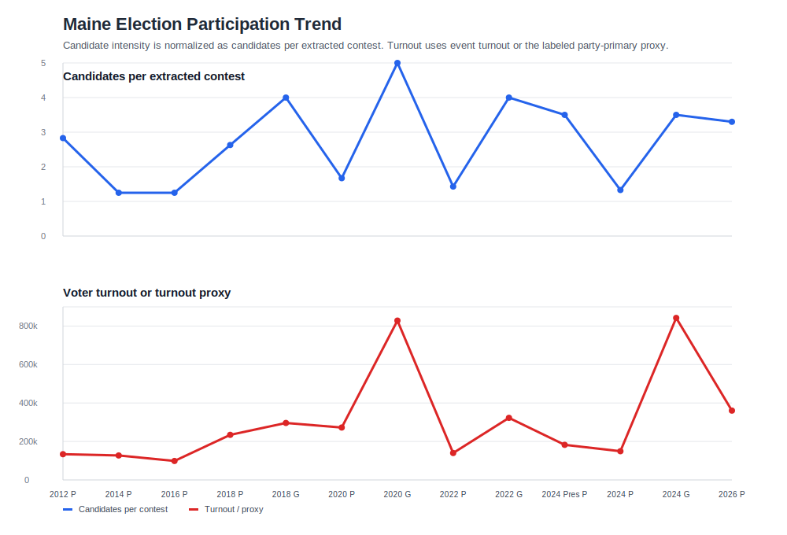

# ELEC-015 Maine RCV Participation Data

This file compares Maine election events using official Maine Secretary of State result data. The comparison unit is the election event, not each individual municipal row, candidate subtotal, cast-vote-record line, or tabulation round.

## Working Read

The Maine data remains inconclusive as an RCV-effect signal. Turnout is strongly shaped by election type, especially presidential-year versus midterm cycles, and the general-election series is too sparse to support a causal inference. Candidate counts are no longer treated as a headline metric because they mix ballot-access rules, party strategy, office mix, write-in treatment, and ordinary cycle effects.

The more useful voter-behavior metric is **alternative vote expression**: the share of nonblank contest votes cast for candidates or officially tabulated vote categories outside the Democratic and Republican nominees. This includes printed independent/minor-party candidates and official write-in/other columns where Maine reports them. It excludes blanks, undervotes, overvotes, and later RCV transfer-round totals. For RCV contests, the metric uses first-choice totals only.

That metric still does not show a clean RCV-linked pattern. The largest fully reduced midterm values appear in 2010 and 2018, both of which had unusually salient independent candidates in statewide or congressional contests. Presidential-year alternative vote expression is low in 2008 and 2012, rises in 2016, then falls in 2020 and 2024 despite RCV availability for federal offices.

Tentative conclusion: Maine's election-result data does not presently show that RCV produces a clear, measurable increase in candidate participation or alternative vote expression. The most noticeable movement is in regular-primary turnout after 2018, but that timing is heavily confounded because 2018 was both Maine's first RCV-use cycle and the first midterm election of the Trump era. The election data therefore supports, at most, a cautious hypothesis that RCV may correlate with higher primary participation in some contexts, not a conclusion that RCV caused the increase.

The next useful evidence layer is voter sentiment and voter experience rather than additional election-result reduction alone. The next pass should test whether Maine voters understood RCV, preferred it, found it burdensome or empowering, believed it changed candidate choice, or experienced ballot-completion problems, and whether those views differed by party, geography, age, education, or election type.

## Election Comparison Table

| Election name | RCV or not | Voter turnout | Alternative vote-expression status |
| --- | --- | ---: | --- |
| 2006-06-13 Primary Election | No | 104,253 | Not applied; FEC statewide U.S. Senate primary-vote proxy |
| 2006-11-07 General Election | No | 543,981 federal Senate ballots | 4.76% across FEC-verified U.S. Senate, CD-1, and CD-2 contests; Governor result data located in a secondary state-tabulation mirror but not folded into the primary table pending a direct state archive or trusted dataset source |
| 2008-06-10 Primary Election | No | 138,050 | Not applied; FEC statewide U.S. Senate primary-vote proxy |
| 2008-11-04 General Election | No | 731,163 | 1.91% in the statewide presidential contest, including independent, Green Independent, and write-in candidates reported in FEC's official federal-results workbook |
| 2010-06-08 Primary Election | No | 190,321 | Not applied; FEC U.S. House district primary-vote proxy summed statewide because no statewide U.S. Senate contest was held |
| 2010-11-02 General Election | No | 580,538 | 21.58% across extracted Governor, CD-1, and CD-2 general contests, including official declared write-ins/other columns and excluding blanks |
| 2011-11-08 Referendum Election | No; noncandidate context year | Pending legacy XLS reduction | Not applicable; statewide referendum context year, not a candidate-vote measure |
| 2012-06-12 Primary Election | No | 133,915 | Not applied; party-primary candidate mix is not comparable to general-election D/R alternatives |
| 2012-11-06 General Election | No | 724,758 | 2.75% in the statewide presidential contest, including declared write-ins and excluding blanks |
| 2014-06-10 Primary Election | No | 127,398 | Not applied; party-primary candidate mix is not comparable to general-election D/R alternatives |
| 2014-11-04 General Election | No | 616,967 | 6.14% across extracted U.S. Senate, Governor, CD-1, and CD-2 general contests, including official other/write-in columns and excluding blanks |
| 2016-06-14 Primary Election | No | 98,776 | Not applied; party-primary candidate mix is not comparable to general-election D/R alternatives |
| 2016-11-08 General Election | No | 771,892 | 7.30% in the statewide presidential contest, including Libertarian, Green Independent, Unenrolled, and other officially tabulated non-D/R candidates and excluding blanks |
| 2018-06-12 Primary Election | Yes, mixed with non-RCV contests | 234,380 | Not applied; party-primary candidate mix is not comparable to general-election D/R alternatives |
| 2018-11-06 General Election | Yes for CD-2; non-RCV statewide and CD-1 offices also extracted | 646,064 | 22.94% across extracted U.S. Senate, Governor, CD-1, and CD-2 first-choice general contests, including official other/write-in columns and excluding blanks/overvotes/undervotes |
| 2020-07-14 Primary Election | Yes, mixed with non-RCV contests | 272,325 | Not applied; party-primary candidate mix is not comparable to general-election D/R alternatives |
| 2020-11-03 General Election | Yes for federal offices | 828,305 | 2.89% in the statewide presidential contest, including Alliance, Green Independent, Libertarian, and official other columns and excluding blanks |
| 2022-06-14 Primary Election | Yes, mixed with non-RCV contests | 139,995 | Not applied; party-primary candidate mix is not comparable to general-election D/R alternatives |
| 2022-11-08 General Election | Yes for CD-2; non-RCV Governor and CD-1 offices also extracted | 680,909 | 2.56% across extracted Governor, CD-1, and CD-2 first-choice general contests, including official other/write-in columns and excluding blanks |
| 2024-03-05 Presidential Primary Election | No | 182,378 | Not applied; party-primary candidate mix is not comparable to general-election D/R alternatives |
| 2024-06-11 State Primary Election | No in extracted federal primary contests | 149,165 | Not applied; party-primary candidate mix is not comparable to general-election D/R alternatives |
| 2024-11-05 General Election | Yes for federal offices | 842,447 | 2.13% in the statewide presidential contest, including Libertarian, Green Independent, Justice For All, and official other columns and excluding blanks |
| 2026-06-09 Primary Election | Yes, mixed with non-RCV contests | 360,386 | Not applied; party-primary candidate mix is not comparable to general-election D/R alternatives |

## Alternative Vote-Expression Table

This table preserves the reduced values behind the percentage shown above. The denominator is nonblank contest votes in the extracted contest set, not unique voters. Midterm rows aggregate the extracted statewide/federal contests available for that election event. Presidential-year rows use the statewide presidential contest as the cleaner same-office comparison.

| Election event | Trend series | RCV exposure | Metric scope | Alternative votes | Nonblank contest votes | Alternative vote expression |
| --- | --- | --- | --- | ---: | ---: | ---: |
| 2006-11-07 General Election | Midterm general | Non-RCV | U.S. Senate, CD-1, CD-2; federal-only official baseline | 51,428 | 1,079,846 | 4.76% |
| 2008-11-04 General Election | Presidential-year general | Non-RCV | President | 13,967 | 731,163 | 1.91% |
| 2010-11-02 General Election | Midterm general | Non-RCV | Governor, CD-1, CD-2 | 245,356 | 1,137,134 | 21.58% |
| 2012-11-06 General Election | Presidential-year general | Non-RCV | President | 19,598 | 713,180 | 2.75% |
| 2014-11-04 General Election | Midterm general | Non-RCV | U.S. Senate, Governor, CD-1, CD-2 | 110,920 | 1,807,581 | 6.14% |
| 2016-11-08 General Election | Presidential-year general | Non-RCV | President | 54,599 | 747,927 | 7.30% |
| 2018-11-06 General Election | Midterm general | RCV activated in CD-2 only | U.S. Senate, Governor, CD-1, CD-2 first choices | 435,130 | 1,896,753 | 22.94% |
| 2020-11-03 General Election | Presidential-year general | RCV available for federal offices | President | 23,652 | 819,461 | 2.89% |
| 2022-11-08 General Election | Midterm general | RCV activated in CD-2 only | Governor, CD-1, CD-2 first choices | 34,316 | 1,341,798 | 2.56% |
| 2024-11-05 General Election | Presidential-year general | RCV available for federal offices | President | 17,746 | 831,375 | 2.13% |

## Turnout Trend Table

This table keeps voter participation visible across primary and general election events while separating it from the alternative-vote metric.

| Election event | Trend series | RCV exposure | Turnout measure |
| --- | --- | --- | ---: |
| 2006-06-13 Primary Election | Regular primary | Non-RCV | 104,253 FEC statewide U.S. Senate primary-vote proxy |
| 2006-11-07 General Election | Midterm general | Non-RCV | 543,981 federal Senate ballots; Governor turnout source pending |
| 2008-06-10 Primary Election | Regular primary | Non-RCV | 138,050 FEC statewide U.S. Senate primary-vote proxy |
| 2008-11-04 General Election | Presidential-year general | Non-RCV | 731,163 |
| 2010-06-08 Primary Election | Regular primary | Non-RCV | 190,321 FEC statewide-summed U.S. House primary-vote proxy |
| 2010-11-02 General Election | Midterm general | Non-RCV | 580,538 |
| 2011-11-08 Referendum Election | Referendum context | Non-RCV | Pending legacy XLS reduction |
| 2012-06-12 Primary Election | Regular primary | Non-RCV | 133,915 |
| 2012-11-06 General Election | Presidential-year general | Non-RCV | 724,758 |
| 2014-06-10 Primary Election | Regular primary | Non-RCV | 127,398 |
| 2014-11-04 General Election | Midterm general | Non-RCV | 616,967 |
| 2016-06-14 Primary Election | Regular primary | Non-RCV | 98,776 |
| 2016-11-08 General Election | Presidential-year general | Non-RCV | 771,892 |
| 2018-06-12 Primary Election | Regular primary | RCV mixed | 234,380 |
| 2018-11-06 General Election | Midterm general | RCV activated in CD-2 only | 646,064 |
| 2020-07-14 Primary Election | Regular primary | RCV mixed | 272,325 |
| 2020-11-03 General Election | Presidential-year general | RCV available for federal offices | 828,305 |
| 2022-06-14 Primary Election | Regular primary | RCV mixed | 139,995 |
| 2022-11-08 General Election | Midterm general | RCV activated in CD-2 only | 680,909 |
| 2024-03-05 Presidential Primary Election | Presidential primary | Non-RCV | 182,378 |
| 2024-06-11 State Primary Election | Regular primary | Non-RCV in extracted contests | 149,165 |
| 2024-11-05 General Election | Presidential-year general | RCV available for federal offices | 842,447 |
| 2026-06-09 Primary Election | Regular primary | RCV mixed | 360,386 |

The graph separates the alternative vote-expression metric from turnout. The x-axis now spans 2006-2026 to preserve the requested four-year historical extension. The 2006, 2008, and 2010 regular-primary rows are plotted from FEC official federal primary-vote totals; 2010 uses statewide-summed U.S. House primary votes because no statewide U.S. Senate contest was held. The 2008 presidential row is plotted from FEC official federal results. The 2006 federal-only general-election row is tabulated above but not connected into the midterm-general line because it does not yet include a directly sourced Governor value comparable to later midterm rows. Maine's current online previous-results page provides 2010-forward state files and directs users to the Division of Elections for earlier result requests. Light vertical shading marks presidential election years. The dashed vertical line marks 2018, when Maine first used RCV in statewide/federal election administration.

Sources: Maine Secretary of State [Election Results/Data](https://www.maine.gov/sos/elections-voting/election-results-data), [Previous Election Year Results](https://www.maine.gov/sos/elections-voting/election-results-data/previous-election-results), [2014/2015 Election Results](https://www.maine.gov/sos/elections-voting/election-results-data/election-results-2014-2015), [2016/2017 Election Results](https://www.maine.gov/sos/elections-voting/election-results-data/election-results-2016-2017), [2018 Election Results](https://www.maine.gov/sos/elections-voting/election-results-data/election-results-2018), [2020 Election Results](https://www.maine.gov/sos/elections-voting/election-results-data/election-results-2020), [2022 Election Results](https://www.maine.gov/sos/node/1956), [2024 Election Results](https://www.maine.gov/sos/node/2479), [Ranked-Choice Voting FAQ](https://www.maine.gov/sos/elections-voting/ranked-choice-voting-frequently-asked-questions), FEC [Federal Elections 2006](https://www.fec.gov/introduction-campaign-finance/election-results-and-voting-information/federal-elections-2006/), FEC [Federal Elections 2008](https://www.fec.gov/introduction-campaign-finance/election-results-and-voting-information/federal-elections-2008/), and FEC [Federal Elections 2010](https://www.fec.gov/introduction-campaign-finance/election-results-and-voting-information/federal-elections-2010/).
